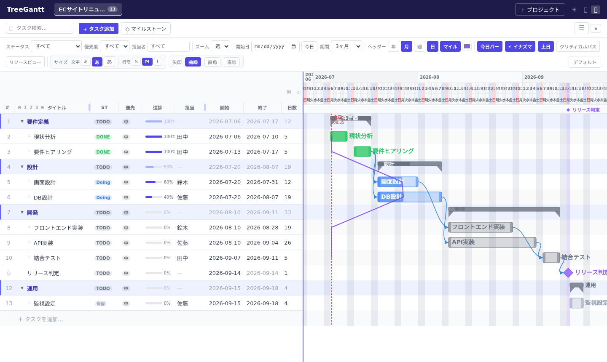
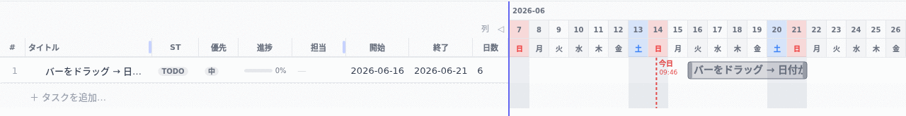
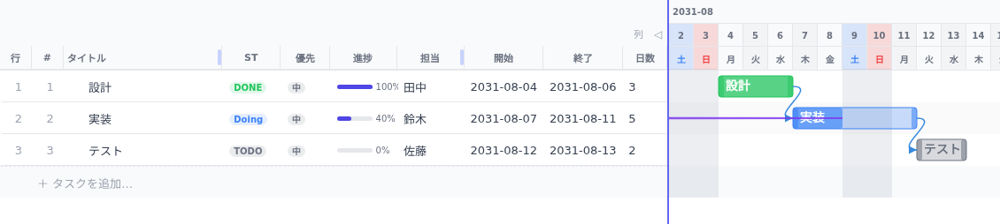
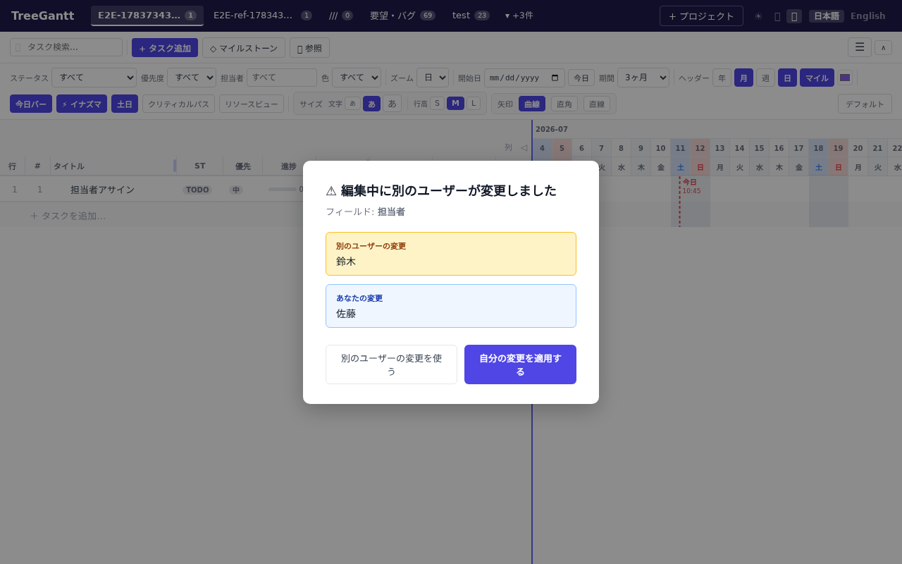

<div align="center">

# 🌳 TreeGantt

**ツリー構造 × ガントチャートで、プロジェクトを“見たまま”動かす。**

複数ブラウザでリアルタイム同期する、社内向けプロジェクト/タスク管理ツール。


[](https://github.com/aki1jp/treegantt/actions/workflows/ci.yml)


</div>



---

## なぜ TreeGantt？

- 🌳 **ツリー × ガント** — 親子でネストしたタスクを、そのままガントチャートで可視化。親バーは子の期間・進捗を自動集計。
- ⚡ **リアルタイム同期** — WebSocket で複数ブラウザを即時同期。誰かの編集がすぐ全員に反映。
- 🪶 **軽量・自己完結** — データストアは SQLite 1ファイル。社内サーバーへ `docker compose` で即デプロイ。
- 🖱️ **直感操作** — バーのドラッグで日付変更、ドラッグ＆ドロップで依存付け、セルのインライン編集。

---

## ✨ 主な機能

- 📊 **ガントチャート** — 日/週/月の 3 段階ズーム、3〜24ヶ月の表示期間切替
- 🌳 **ツリー構造** — 親子タスクの折りたたみ／展開、親バーへの自動集計（期間・進捗）
- 🖱️ **ドラッグで日付設定** — バーを掴んで移動・リサイズ（下記 GIF）
- 🔗 **依存関係** — 先行/後続をドラッグ＆ドロップで接続（ベジェ/直角/直線）
- ⚡ **イナズマライン** — 全タスクの進捗到達点を折れ線で可視化し、遅れを直感把握
- 🎯 **クリティカルパス** — CPM で余裕ゼロの経路を強調
- ✏️ **インライン編集** — WBS のセルを直接編集
- 👥 **担当者別負荷ビュー** — 日付×担当のヒートマップ
- 🔗 **クロスプロジェクト参照** — 他プロジェクトのタスクを読み取り専用で表示し、プロジェクトを跨いだ先行/後続も設定可能
- 🔄 **競合解決 UI** — 同一フィールドの同時編集を自分/相手で選択
- 🗂️ **マルチプロジェクト** — タブで切替
- 📥 **Import / Export** — JSON・CSV でバックアップ/移行
- 🚩 **マイルストーン** — 期日単体のタスク。ガント上に◆で表示し、依存関係の後続にできる
- 💾 **自動バックアップ** — 起動時＋定期的に SQLite のスナップショットを世代管理付きで保存（下記「運用 Tips」参照）
- 📖 **API 仕様書（Swagger）** — OpenAPI 定義をブラウザで閲覧・試行可能（`/docs`）

### 🖱️ ドラッグで開始日・終了日を設定

ガントバーを掴んで動かすだけで、開始日・終了日が変わり WBS にも即反映されます。



---

## 📸 スクリーンショット

全体像は冒頭を参照。依存関係・競合解決 UI 個別のスクリーンショットは近日追加予定（画像は `docs/images/` に配置）。

<!--
| 依存関係 | 競合解決 |
|----------|----------|
|  |  |
-->

---

## 🚀 クイックスタート

### 前提
- Node.js **20 以上** / npm

### 開発（ホットリロード）
```bash
git clone <repository-url>
cd treegantt
bash start.sh        # API + フロントエンドを一括起動
```

| エンドポイント | URL |
|---------------|-----|
| フロントエンド | http://localhost:3000 |
| API（ヘルス） | http://localhost:4000/health |
| API 仕様書（Swagger UI） | http://localhost:4000/docs |
| WebSocket | ws://localhost:4001 |

停止は `Ctrl+C` または `bash stop.sh`。

### 本番（Docker）
```bash
docker compose build
docker compose up -d
```
`http://<サーバーIP>:3000` でアクセス。API/WS の接続先はブラウザの `window.location.hostname` から自動検出されるため、設定変更なしで動作します。データは `api/data/treegantt.db`（ホストにマウント）へ永続化されます。

> 設定（ポート等）の変更は下記 **「⚙️ 設定」** を参照。

---

## ⚙️ 設定（`.env` / 環境変数でポート等を変更）

ポートなどの設定は **プロジェクトルートの `.env`** か **環境変数**で変更できます。`.env` は
開発（`start.sh`）と Docker の**両方で同じものが使われます**。

```bash
cp .env.example .env     # テンプレをコピーして編集
bash start.sh            # 開発
docker compose up -d     # 本番
```

環境変数で直接渡すこともできます:

```bash
PORT=5000 WS_PORT=5001 FRONTEND_PORT=3005 bash start.sh
```

### 設定キー（`.env.example` と同じ）
| キー | 既定 | 説明 |
|------|------|------|
| `FRONTEND_PORT` | `3000` | フロントエンドの表示ポート |
| `PORT` | `4000` | REST API ポート |
| `WS_PORT` | `4001` | WebSocket ポート |
| `VITE_API_URL` | `http://localhost:4000` | **ブラウザからの API 接続先** |
| `VITE_WS_URL` | `ws://localhost:4001` | **ブラウザからの WebSocket 接続先** |
| `DB_PATH` | `api/data/treegantt.db`（Docker では `/app/data/treegantt.db`） | SQLite ファイルのパス |
| `CORS_ORIGIN` | `*` | CORS 許可オリジン |
| `BACKUP_DIR` | DB と同じディレクトリ配下の `backups/` | 定期バックアップの保存先 |
| `BACKUP_INTERVAL_HOURS` | `24` | バックアップ間隔（時間）。`0` で定期実行を無効化（起動時の1回は実行される） |
| `BACKUP_RETENTION` | `7` | 保持するバックアップ世代数（超過分は古い順に削除） |
| `LDAP_ENABLED` | `false` | LDAP 認証（将来用・未使用） |

> ⚠️ **`PORT` / `WS_PORT` を変えたら `VITE_API_URL` / `VITE_WS_URL` も合わせてください。**
> フロントは既定で `:4000` / `:4001` に接続するため、API ポートだけ変えると繋がりません。
> `FRONTEND_PORT` のみの変更は単独で OK です。

### 優先順位（開発と Docker で逆なので注意）
| 起動方法 | 優先順位 |
|----------|----------|
| `bash start.sh`（開発） | **`.env` > 環境変数** — start.sh が `.env` を `source` するため、`.env` があればその値が勝つ |
| `docker compose`（本番） | **環境変数 > `.env`** — Compose の仕様 |

混乱を避けるため、**どちらか一方（推奨は `.env`）に統一**して運用するのがおすすめです。
開発で環境変数だけで指定したい場合は `.env` を置かないでください。

---

## 🤖 AI連携（MCP）

AI（Claude Code / Claude Desktop 等）から TreeGantt を参照・編集できる MCP サーバーを
`mcp/` に同梱している。TreeGantt本体（`api`/`frontend`）はこれを一切知らず、既存の REST API を
外部から叩くだけ。読み取り5ツールに加え、タスクの作成・更新・削除ツール（段階1）も提供する
（承認はMCPクライアント側の確認プロンプトに委ねる方針。並び替えは段階2で未実装）。
方針の詳細は [`docs/ai_integration_policy.md`](docs/ai_integration_policy.md)、
使い方は [`mcp/README.md`](mcp/README.md) を参照。

| 環境 | やること |
|------|---------|
| 開発 | `bash start.sh`（`mcp/` の依存関係もここで自動インストールされる） |
| AIクライアント登録 | `.mcp.json` に1回だけ設定を追加（`mcp/README.md` にスニペットあり） |

`mcp/` はビルド不要（`tsx` で直接実行）で、`api`/`frontend` のような常時稼働サーバーではないため
Docker イメージ化はしていない。本番の TreeGantt を参照したい場合も `mcp/` はローカルで動かし、
`API_BASE_URL` に本番サーバーの URL を指定するだけでよい（`mcp/README.md` の「開発環境と本番環境」参照）。

---

## 🧰 運用 Tips（よくある操作）

| やりたいこと | 方法 |
|--------------|------|
| **バックアップ** | 起動時＋既定 24 時間ごとに `api/data/backups/` へ自動保存（既定 7 世代ローテーション、設計書 §13.4）。手動でも `api/data/treegantt.db` のコピーや ☰ メニューの **JSON・CSV エクスポート** が可能 |
| **復元** | API 停止 → `api/data/backups/` の任意のバックアップファイルを `api/data/treegantt.db` へコピー（WAL/SHM が残っていれば削除）→ 起動。手順の詳細は設計書 §13.4。手動コピー分や ☰ → インポート（レストア＝既存を置換、追記も可）でも復元可 |
| **DB を初期化** | `api/data/treegantt.db*` を削除して再起動（マイグレーションで自動再作成） |
| **ログ確認** | Docker: `docker compose logs -f` ／ 開発: `start.sh` の `[API]` / `[FE]` 出力 |
| **停止** | 開発: `Ctrl+C` または `bash stop.sh` ／ Docker: `docker compose down` |
| **更新・再デプロイ** | `docker compose build && docker compose up -d` |

---

## 🩺 トラブルシューティング

| 症状 | 原因と対処 |
|------|-----------|
| **更新に失敗しました: Failed to fetch** | フロント⇔API のクロスオリジン不一致。`CORS_ORIGIN` がフロントの URL を許可しているか、`VITE_API_URL` が正しい API ポートを指しているか確認 |
| **ポートが使用中（address already in use）** | `.env` でポートを変更、または `bash stop.sh` で既存プロセスを停止 |
| **ポート変更後フロントが API に繋がらない** | `VITE_API_URL` / `VITE_WS_URL` を新しいポートに合わせる（既定は `:4000` / `:4001`） |

---

## 🧩 技術スタック

| 区分 | 採用技術 |
|------|---------|
| フロントエンド | React 18 / TypeScript / Vite / Zustand / dayjs / react-markdown |
| API | **Fastify 5** / TypeScript / better-sqlite3 |
| リアルタイム | WebSocket（`ws`）broadcast 方式 |
| テスト | Vitest / Testing Library / **Playwright（E2E）** |
| 配信 | Docker multi-stage（`node:20-slim`） |

---

## 🏗 アーキテクチャ

```
ブラウザ A                  ブラウザ B
   │                           │
   │ REST (4000)   WebSocket (4001)
   └──────────┬────────────────┘
              │
          Fastify API
              │
          SQLite DB  ←── 唯一の真の状態
```

- タスク更新は必ず REST API 経由で SQLite に書き込む
- 書き込み後、API が同一プロジェクトの全クライアントへ WebSocket broadcast
- フロントは楽観的更新 → broadcast 受信でサーバー値に整合

---

## ✅ テスト

合計 1,400 件超（API/フロント/E2E）。内訳は設計書 **[14. テスト構成](docs/treegantt_design.md)** を参照。

```bash
cd api      && npm test            # API（サービス/ルート/WS/CORS/本番配線）
cd frontend && npm test -- --run   # フロント（計算/描画/ストア/hooks/コンポーネント）
cd e2e      && npx playwright test  # E2E（実ブラウザ・クロスオリジン実構成）
```

- **ユニット**：純関数（ガント計算・ツリー集計・ソート・Import/Export 等）
- **結合**：Fastify `inject` による API、`buildApp()` で本番配線（CORS プリフライト含む）
- **E2E**：Playwright で CRUD・ガント描画・**バードラッグでの日付変更**などを実ブラウザ検証
- **カバレッジ**：`npx vitest run --coverage`（provider=istanbul、`coverage/index.html` で per-file 確認）

---

## 📚 ドキュメント

- 📘 [`docs/treegantt_design.md`](docs/treegantt_design.md) — **完全仕様書**（これ一冊で再実装できることを目標）
- 📋 [`docs/FEATURES.md`](docs/FEATURES.md) — 初期仕様の記録（現行仕様は設計書を参照）
- ⚙️ [`docs/performance_plan.md`](docs/performance_plan.md) — 1000件パフォーマンス改善の記録
- 🤖 [`docs/ai_integration_policy.md`](docs/ai_integration_policy.md) — AI連携（MCPサーバー）の方針・経緯

---

## 🗺 ロードマップ

CI（GitHub Actions）・ESLint・E2E(Playwright) の自動化・a11y の基本方針（aria-label 等）は導入済みです。
残る検討事項（Prettier、カバレッジ閾値、a11y の自動チェック、ビジュアルリグレッション 等）は
設計書の **「17. 今後の検討事項」** に整理しています。

---

## 🛠 DB 管理（開発用）

```bash
docker compose --profile dev-tools up db-ui   # → http://localhost:8888
```
SQLite の中身をブラウザで確認できます（**本番では無効化**してください／無認証のため）。

---

## 📄 ライセンス

MIT
